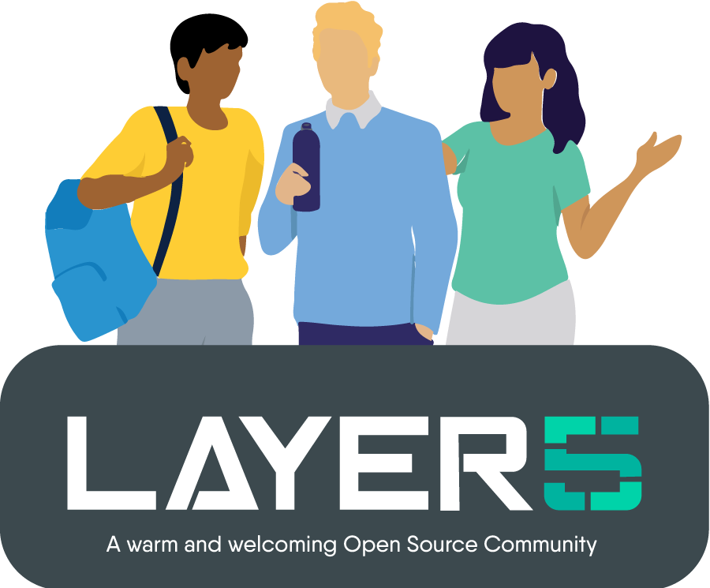

# Docker 101 Workshop
An workshop that introduces Linux containers through concepts in [slides](https://calcotestudios.com/talks/decks/slides-developerweek-austin-2018-linux-containers-101) and hands-on labs.

## Join the service mesh community!

Our projects are community-built and welcome collaboration. 👍 Be sure to see the <a href="https://docs.google.com/document/d/17OPtDE_rdnPQxmk2Kauhm3GwXF1R5dZ3Cj8qZLKdo5E/edit">Layer5 Community Welcome Guide</a> for a tour of resources available to you and jump into our <a href="http://slack.layer5.io">Slack</a>!

<h3>Find your MeshMate</h3>

MeshMates are experienced Layer5 community members, who will help you learn your way around, discover live projects and expand your community network. 
Become a <b>Meshtee</b> today!

Find out more on the <a href="https://layer5.io/community/meshmate">Layer5 community</a>.  
    

✔️ <em><strong>Join</strong></em> any or all of the weekly meetings on <a href="https://calendar.google.com/calendar/b/1?cid=bGF5ZXI1LmlvX2VoMmFhOWRwZjFnNDBlbHZvYzc2MmpucGhzQGdyb3VwLmNhbGVuZGFyLmdvb2dsZS5jb20">community calendar</a>. 
✔️ <em><strong>Watch</strong></em> community <a href="https://www.youtube.com/playlist?list=PL3A-A6hPO2IMPPqVjuzgqNU5xwnFFn3n0">meeting recordings</a>. 
✔️ To Access Community Drive, fill <a href="https://docs.google.com/forms/d/e/1FAIpQLSdMLeZY6hZ46yYNkoKKV5OM-jCypjbYcqptbUNltEE73EqCjA/viewform">Community Member Form</a>. 

<i>Not sure where to start?</i> Grab an open issue with the <a href="https://github.com/issues?utf8=✓&q=is%3Aopen+is%3Aissue+archived%3Afalse+org%3Alayer5io+label%3A%22help+wanted%22+">help-wanted label</a>.

## Authors

* Lee Calcote [Twitter](https://twitter.com/lcalcote), [LinkedIn](https://linkedin.com/in/leecalcote), [Blog](https://gingergeek.com), [Talks](https://calcotestudios.com)  
  * See other talks and workshops given by Lee at https://calcotestudios.com/talks.

### About Layer5

**Community First**
The <a href="https://layer5.io">Layer5</a> community represents the largest collection of service mesh projects and their maintainers in the world.

**Open Source First**
We build projects to provide learning environments, deployment and operational best practices, performance benchmarks, create documentation, share networking opportunities, and more. Our shared commitment to the open source spirit pushes Layer5 projects forward.
